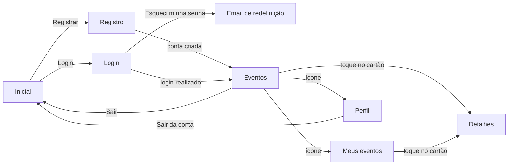

# CampusHub

Plataforma onde alunos podem visualizar os eventos da universidade e se inscrever neles.

App Android feito com Kotlin, Firebase Authentication e Cloud Firestore.

## Funcionalidades

- **Conta:** registro com nome, curso, email e senha (com confirmação), login, logout e recuperação de senha por email
- **Login automático:** quem já entrou vai direto para os eventos ao abrir o app
- **Eventos:** lista com data, horário, local, vagas restantes, curso responsável e se o evento é aberto a todos ou exclusivo do curso
- **Detalhes:** data por extenso, descrição completa e o botão de inscrição
- **Inscrição e cancelamento:** controle de vagas, bloqueio quando o evento lota e bloqueio de eventos exclusivos para alunos de outros cursos
- **Meus eventos:** só os eventos em que o aluno está inscrito
- **Perfil:** mostra o email e permite editar o nome e o curso
- **Modo escuro:** todas as telas acompanham o tema do sistema

## Telas

- **Inicial:** nome do app e botões de Login e Registrar
- **Registro:** nome, curso (escolhido numa lista), email, senha e confirmação de senha
- **Login:** email e senha, com o link **Esqueci minha senha**
- **Eventos:** saudação com o nome do aluno e cartões com data, horário, local, vagas restantes e as etiquetas de curso e de acesso
- **Detalhes do evento:** informações completas, descrição e o botão de inscrição ou cancelamento
- **Meus eventos:** os eventos em que o aluno está inscrito, ou um aviso quando ainda não há inscrições
- **Perfil:** avatar com as iniciais, email e edição do nome e do curso

## Fluxo



1. O app abre na tela **Inicial**. Se já existe uma sessão salva, vai direto para os **Eventos**.
2. No **Registro**, o Firebase cria a conta e o app salva nome, curso e email no Firestore.
3. No **Login**, o link **Esqueci minha senha** manda um email de redefinição pelo Firebase.
4. Nos **Detalhes**, o aluno se inscreve ou cancela. O botão fica desativado, mostrando o motivo, quando o evento lota ou é exclusivo de outro curso.
5. **Meus eventos** e **Perfil** abrem pelos ícones da barra. O **Sair** fica no menu ⋮ e no perfil.

## Banco de dados (Firestore)

```
users/{uid}                          perfil do aluno
    name, course, email
    enrollments/{eventId}            uma inscrição por evento
        eventId, enrolledAt

events/{eventId}
    title, description, location, date
    capacity, enrolledCount
    course, openToAll
```

- O `uid` vem do Firebase Authentication, o que liga o perfil à conta.
- A inscrição usa o id do evento como id do documento, então o aluno não se inscreve duas vezes no mesmo evento.
- **Inscrever e cancelar são transações:** a inscrição e o contador `enrolledCount` mudam juntos. Se dois alunos tentarem a última vaga ao mesmo tempo, o Firestore repete uma das tentativas, que encontra o evento lotado.
- Na primeira execução, se a coleção `events` estiver vazia, o app grava 8 eventos de exemplo (`SampleEvents.kt`), um para cada curso.

## Arquitetura

Cada tela é uma `Activity` com o seu layout XML, e as próprias Activities chamam o Firebase.

```
app/src/main/
├── java/br/com/uri/campushub/
│   ├── MainActivity.kt           tela inicial e login automático
│   ├── RegisterActivity.kt       cria a conta e o perfil
│   ├── LoginActivity.kt          login e recuperação de senha
│   ├── EventsActivity.kt         lista de eventos
│   ├── EventDetailsActivity.kt   detalhes, inscrição e cancelamento
│   ├── MyEventsActivity.kt       eventos em que o aluno está inscrito
│   ├── ProfileActivity.kt        dados do aluno
│   ├── Event.kt                  modelo do evento e formatação das datas
│   ├── EventAdapter.kt           cartões da RecyclerView
│   ├── EventChips.kt             etiquetas de curso e de acesso
│   └── SampleEvents.kt           eventos de exemplo
├── res/
│   ├── layout/                   telas, cartão do evento e diálogo de senha
│   ├── drawable/                 ícones e fundos
│   ├── menu/                     menu da barra dos eventos
│   ├── values/                   textos, cores, temas, estilos e lista de cursos
│   └── values-night/             cores e temas do modo escuro
└── AndroidManifest.xml
```

- **Navegação** com `Intent`. As telas de detalhes recebem só o id do evento e buscam os dados atualizados.
- **Telas com conteúdo no topo** usam uma `MaterialToolbar` própria e ajustam o espaço das barras do sistema, já que a partir do Android 15 o app desenha atrás delas.
- **Textos** da interface ficam em `strings.xml`, e os cursos em um `string-array`.

## Tecnologias

- Kotlin com layouts XML
- Firebase Authentication (email e senha) e Cloud Firestore
- Material Components (cartões, etiquetas, campos e botões)
- RecyclerView
- minSdk 36

## Como rodar

1. Clone o repositório e abra no Android Studio.
2. Crie um projeto no [console do Firebase](https://console.firebase.google.com/) e adicione um app Android com o pacote `br.com.uri.campushub`.
3. Baixe o arquivo `google-services.json` e coloque na pasta `app/`. Ele não está no repositório.
4. No console do Firebase:
   - em **Authentication > Método de login**, ative **E-mail/senha**;
   - em **Firestore Database**, crie o banco em **modo de teste**.
5. Sincronize o Gradle e rode o app. Os eventos de exemplo são criados no primeiro acesso à lista.
